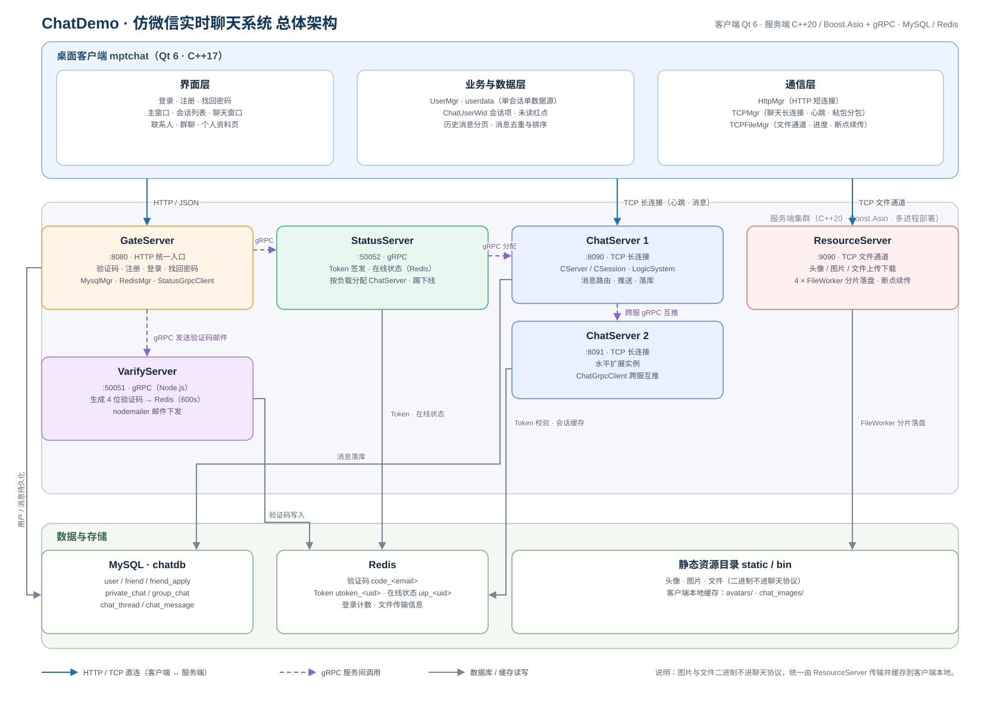
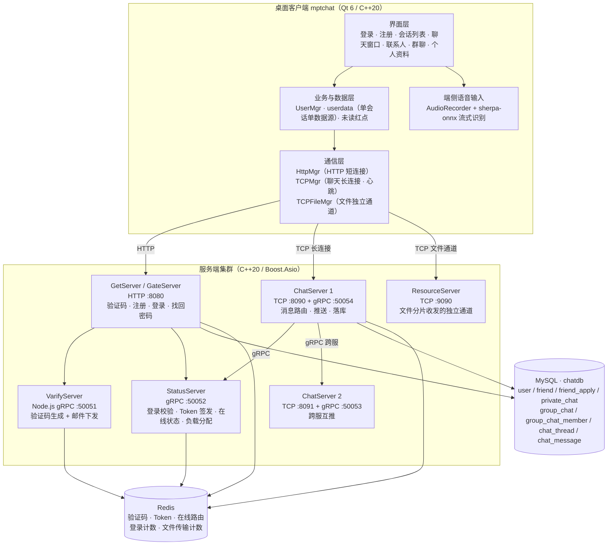
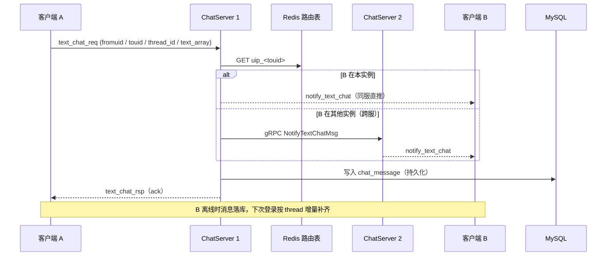

<div align="center">

# ChatDemo · 分布式即时通讯系统

**从自定义协议到桌面客户端全部自研的 IM 系统 —— C++20 / Boost.Asio 多 Reactor 服务端集群 + Qt 6 客户端**

[](https://github.com/mpt888666-collab/mptchat/actions/workflows/ci.yml)


`C++20` · `Boost.Asio` · `gRPC / Protobuf` · `MySQL` · `Redis` · `Qt 6` · `Node.js` · `CMake / vcpkg`

</div>

---

## 目录

- [一、项目简介](#一项目简介)
- [二、系统架构](#二系统架构)
- [三、技术栈](#三技术栈)
- [四、快速开始](#四快速开始)
- [五、配置说明](#五配置说明)
- [六、测试](#六测试)
- [七、性能压测](#七性能压测)
- [八、CI / CD](#八cicd)
- [九、工程实践与踩坑记录](#九工程实践与踩坑记录)
- [十、目录结构](#十目录结构)
- [十一、Roadmap](#十一roadmap)

---

## 一、项目简介

ChatDemo 是一套完整自研的桌面即时通讯系统，覆盖「账号 → 好友 → 实时单聊 → 图片 / 文件传输 → 群聊」全链路。
**没有依赖任何现成 IM 框架**：通信协议、消息分发、在线状态管理、文件分片传输全部自己设计实现；
服务端拆分为 5 个独立服务，支持多实例部署与跨服消息互通。

设计目标：

| 目标 | 落地方式 |
| --- | --- |
| 高并发接入 | Boost.Asio 多 Reactor + 工作线程池，单实例承载数千并发长连接，多实例横向扩展 |
| 消息不丢、不重、不乱序 | 落库 + ack + 客户端按 `msg_id` 去重排序，支持离线消息增量补齐 |
| 协议自研可控 | 二进制帧协议：`msg_id(2B) + len(2B) + JSON body`，比纯文本协议更省带宽、易扩展 |
| 多媒体可靠传输 | 图片 / 文件走独立通道，分片上传、进度回调、MD5 校验、断点续传 |
| 可扩展可运维 | ChatServer 无状态化，Redis 维护在线路由，配置外置、心跳保活、踢下线可追踪 |

**能力边界**：语音 / 视频通话、朋友圈、支付、移动端与 Web 端不在当前范围内。
客户端内置了端侧流式语音转文字输入（sherpa-onnx），但它输出的是**文本消息**，不是语音消息。

---

## 二、系统架构



> 矢量图：[`docs/architecture.svg`](docs/architecture.svg) ｜ 位图：[`docs/architecture.png`](docs/architecture.png)



### 服务清单

| 服务 | 对外协议 / 端口 | 职责 | 依赖 |
| --- | --- | --- | --- |
| `GetServer`（GateServer） | HTTP :8080 | 验证码、注册、登录、找回密码、Token 校验 | MySQL、Redis、VarifyServer、StatusServer |
| `VarifyServer` | gRPC :50051（Node.js） | 生成 4 位验证码写入 Redis（TTL 600s），nodemailer 发邮件 | Redis |
| `StatusServer` | gRPC :50052 | 登录校验、Token 签发、在线状态、按负载分配 ChatServer | Redis |
| `ChatServer` / `ChatServer2` | TCP :8090 / :8091 + gRPC | 长连接管理（CSession / MsgNode）、心跳、消息路由与推送、好友申请、群聊、离线消息、落库 | MySQL、Redis、StatusServer、对端 ChatServer |
| `ResourceServer` | TCP :9090 | 图片 / 文件分片接收、落盘、下载 | MySQL、Redis、StatusServer |
| `mptchat` | 桌面客户端（Qt 6） | 全部界面与交互、单数据源会话模型、端侧语音输入 | 上述所有服务 |

### 核心链路（发一条文本消息）



---

## 三、技术栈

| 层次 | 技术选型 |
| --- | --- |
| 语言标准 | C++20（服务端）、C++17（Qt 客户端，由 Qt 6 要求）、JavaScript（验证码服务）、Python（压测工具） |
| 网络 | Boost.Asio（多 Reactor + 线程池）、TCP 长连接、HTTP、自定义二进制帧协议 |
| RPC | gRPC + Protocol Buffers（服务间通信与消息互推） |
| 存储 | MySQL（8 张表，utf8mb4）、Redis（验证码 / Token / 在线路由 / 计数） |
| 客户端 | Qt 6（Widgets、Network、Multimedia、QSS、QThread、信号槽） |
| 端侧推理 | sherpa-onnx + 流式 Zipformer（int8）+ ONNX Runtime |
| 构建 | CMake ≥ 3.25、vcpkg（清单模式）、MSVC 2022 / GCC |
| CI | GitHub Actions（Windows + Linux 双平台构建、MySQL 建表校验） |---

## 四、快速开始

### 4.1 依赖与下载地址

服务端依赖全部通过 **vcpkg 清单模式**（仓库根目录的 [`vcpkg.json`](vcpkg.json)）自动安装，Windows / Linux 命令一致。

| 依赖 | 版本要求 | Windows | Linux（Ubuntu 22.04 / 24.04） |
| --- | --- | --- | --- |
| CMake | ≥ 3.25 | <https://cmake.org/download/> ・`winget install Kitware.CMake` | `sudo apt install cmake` 或 <https://cmake.org/download/> |
| Git | 任意 | <https://git-scm.com/download/win> ・`winget install Git.Git` | `sudo apt install git` |
| C++ 编译器 | MSVC 19.4x / GCC 11+ | <https://visualstudio.microsoft.com/visual-cpp-build-tools/>（勾选「使用 C++ 的桌面开发」） | `sudo apt install build-essential` |
| Ninja（可选） | 1.10+ | <https://github.com/ninja-build/ninja/releases> | `sudo apt install ninja-build` |
| vcpkg | 最新 | <https://github.com/microsoft/vcpkg>（`bootstrap-vcpkg.bat`） | <https://github.com/microsoft/vcpkg>（`./bootstrap-vcpkg.sh`） |
| MySQL | 8.0 及以上 | <https://dev.mysql.com/downloads/installer/> | `sudo apt install mysql-server` |
| Redis | 6.0 及以上 | 官方无 Windows 版，三选一：<br>・[tporadowski/redis 5.0.14](https://github.com/tporadowski/redis/releases)（开箱即用）<br>・[Memurai](https://www.memurai.com/get-memurai)（Redis 兼容，Windows 原生）<br>・WSL2 内 `sudo apt install redis-server` | `sudo apt install redis-server` |
| Node.js | 18 LTS 及以上 | <https://nodejs.org/en/download> | `sudo apt install nodejs npm` 或 [nvm](https://github.com/nvm-sh/nvm) |
| Qt | 6.5 及以上 | <https://www.qt.io/download-qt-installer>（勾选 MSVC 2022 64-bit） | `sudo apt install qt6-base-dev qt6-multimedia-dev`，或同一安装器 |
| sherpa-onnx | v1.13.8 | <https://github.com/k2-fsa/sherpa-onnx/releases>（`sherpa-onnx-v1.13.8-win-x64-shared-MD-Release`） | 同页面 `linux-x64-shared` 版本 |
| 语音识别模型 | streaming zipformer zh int8 | <https://github.com/k2-fsa/sherpa-onnx/releases/tag/asr-models>（`sherpa-onnx-streaming-zipformer-zh-int8-2025-06-30`） | 同左 |

> Qt 客户端与语音模型只影响 `mptchat`；只跑服务端时不需要装这两项。
> 客户端还依赖 `libsamplerate`（CMake 包名 `SampleRate`，用于音频重采样），已纳入根目录 `vcpkg.json`，清单模式构建时会自动装好。

### 4.2 Windows 构建（MSVC）

```powershell
git clone https://github.com/mpt888666-collab/mptchat.git
cd mptchat

# 1) 准备 vcpkg（已装可跳过，把下面的路径换成你自己的）
git clone https://github.com/microsoft/vcpkg C:\vcpkg
C:\vcpkg\bootstrap-vcpkg.bat -disableMetrics

# 2) 逐个编译 5 个服务端（首次会由 vcpkg 编译 gRPC 等依赖，约 20-40 分钟）
foreach ($svc in "StatusServer","GetServer","ChatServer","ChatServer2","ResourceServer") {
    cmake -S $svc -B "build\$svc" -G "Visual Studio 17 2022" -A x64 `
        -DCMAKE_TOOLCHAIN_FILE=C:/vcpkg/scripts/buildsystems/vcpkg.cmake `
        -DVCPKG_TARGET_TRIPLET=x64-windows `
        -DVCPKG_MANIFEST_DIR="$PWD"
    cmake --build "build\$svc" --config Release --parallel
}

# 3) 复制配置模板（生成的 exe 在 build\<服务>\Release\）
foreach ($svc in "StatusServer","GetServer","ChatServer","ChatServer2","ResourceServer") {
    Copy-Item "$svc\config.ini.example" "build\$svc\Release\config.ini"
}
```

> vcpkg 会在构建后自动把依赖 DLL 拷到 exe 旁边（`VCPKG_APPLOCAL_DEPS`），一般不需要手工拷贝。

### 4.3 Linux 构建（GCC / Clang）

```bash
git clone https://github.com/mpt888666-collab/mptchat.git
cd mptchat

# 1) 编译工具链
sudo apt update
sudo apt install -y build-essential cmake ninja-build git

# 2) 准备 vcpkg
git clone https://github.com/microsoft/vcpkg.git ~/vcpkg
~/vcpkg/bootstrap-vcpkg.sh -disableMetrics

# 3) 逐个编译服务端
for svc in StatusServer GetServer ChatServer ChatServer2 ResourceServer; do
    cmake -S "$svc" -B "build/$svc" -G Ninja \
        -DCMAKE_BUILD_TYPE=Release \
        -DCMAKE_TOOLCHAIN_FILE="$HOME/vcpkg/scripts/buildsystems/vcpkg.cmake" \
        -DVCPKG_TARGET_TRIPLET=x64-linux \
        -DVCPKG_MANIFEST_DIR="$PWD"
    cmake --build "build/$svc" --parallel
done

# 4) 复制配置模板
for svc in StatusServer GetServer ChatServer ChatServer2 ResourceServer; do
    cp "$svc/config.ini.example" "build/$svc/config.ini"
done
```

> Linux 构建由 CI 在 `ubuntu-latest` 上持续验证（见 [八、CI / CD](#八cicd)）。

### 4.4 准备 MySQL 与 Redis

```bash
# 建库 + 导入表结构（8 张表）
mysql -u root -p -e "CREATE DATABASE IF NOT EXISTS chatdb DEFAULT CHARACTER SET utf8mb4 COLLATE utf8mb4_unicode_ci;"
mysql -u root -p --default-character-set=utf8mb4 chatdb < db/schema.sql

# 校验，应输出 8
mysql -u root -p -N -e "SELECT COUNT(*) FROM information_schema.tables WHERE table_schema='chatdb';"

# 启动 Redis（Windows 下把可执行文件目录加入 PATH 后同样命令）
redis-server
```

字段明细见下面 4.5；完整建表脚本在 [`db/schema.sql`](db/schema.sql)。

### 4.5 数据库表结构（8 张表）

`schema.sql` 由 `mysqldump --no-data` 导出（MySQL 8，字符集 `utf8mb4`），
开头会 `DROP TABLE IF EXISTS`，可以直接重复执行。8 张表按用途分三组：

| 分组 | 表 | 作用 |
| --- | --- | --- |
| 账号 | `user` | 账号、昵称、密码、头像 |
| 好友 | `friend` / `friend_apply` | 好友关系 / 好友申请 |
| 会话与消息 | `chat_thread` / `private_chat` / `group_chat` / `group_chat_member` / `chat_message` | 会话索引 / 单聊 / 群聊 / 群成员 / 消息明细 |

**`user` — 账号**

| 字段 | 类型 | 说明 |
| --- | --- | --- |
| `id` | int，PK，自增 | 用户唯一 ID |
| `username` | varchar(50) | 登录用户名，`UNIQUE` |
| `password` | varchar(100) | 登录密码（当前明文存储，见 Roadmap） |
| `email` | varchar(100) | 邮箱，可空 |
| `nick` | varchar(64) | 昵称 |
| `desc` | varchar(512) | 个性签名 |
| `icon` | varchar(256) | 头像 |
| `sex` | int | 性别，默认 0 |

**`friend` — 好友关系**

| 字段 | 类型 | 说明 |
| --- | --- | --- |
| `id` | int，PK，自增 | 主键 |
| `owner_uid` | int | 持有者 uid |
| `friend_uid` | int | 好友 uid |
| `back_name` | varchar(128) | 备注名 |
| `add_time` | datetime | 添加时间，默认当前时间 |

> `UNIQUE(owner_uid, friend_uid)`。备注名是挂在「持有者」这一侧的，所以 A→B 与 B→A 各是一行、各带自己的备注。

**`friend_apply` — 好友申请**

| 字段 | 类型 | 说明 |
| --- | --- | --- |
| `id` | int，PK，自增 | 主键 |
| `from_uid` | int | 申请人 uid |
| `to_uid` | int | 被申请人 uid |
| `create_time` | datetime | 申请时间，默认当前时间 |
| `status` | tinyint | 0 待处理 / 1 同意 / 2 拒绝 |

> `UNIQUE(from_uid, to_uid)`：同一对用户只保留一条申请记录。

**`chat_thread` — 会话索引**

| 字段 | 类型 | 说明 |
| --- | --- | --- |
| `id` | bigint，PK，自增 | 会话 ID，被 `private_chat` / `group_chat` 引用 |
| `type` | enum('private','group') | 会话类型 |
| `created_at` | timestamp | 创建时间 |

**`private_chat` — 单聊会话**

| 字段 | 类型 | 说明 |
| --- | --- | --- |
| `thread_id` | bigint，PK | 引用 `chat_thread.id` |
| `user1_id` | bigint | 参与方 1 |
| `user2_id` | bigint | 参与方 2 |
| `created_at` | timestamp | 创建时间 |

> `UNIQUE(user1_id, user2_id)` 保证一对用户只有一个单聊会话；
> 另有 `(user1_id, thread_id)`、`(user2_id, thread_id)` 两个索引，用于按人拉会话列表。

**`group_chat` — 群聊会话**

| 字段 | 类型 | 说明 |
| --- | --- | --- |
| `thread_id` | bigint，PK | 引用 `chat_thread.id` |
| `name` | varchar(255) | 群名称，可空 |
| `created_at` | timestamp | 创建时间 |

**`group_chat_member` — 群成员**

| 字段 | 类型 | 说明 |
| --- | --- | --- |
| `thread_id` | bigint | 引用 `group_chat.thread_id`，联合主键之一 |
| `user_id` | bigint | 引用 `user.id`，联合主键之一 |
| `role` | tinyint | 0 普通成员 / 1 管理员 / 2 创建者 |
| `joined_at` | timestamp | 入群时间 |
| `muted_until` | timestamp，可空 | 禁言截止时间，NULL 表示未禁言 |

> 主键 `(thread_id, user_id)` 天然防重复入群；另有 `idx(user_id)` 用于「我加入了哪些群」。

**`chat_message` — 消息明细（文本 / 图片 / 文件共用一张表）**

| 字段 | 类型 | 说明 |
| --- | --- | --- |
| `message_id` | bigint，PK，自增 | 消息 ID |
| `thread_id` | bigint | 所属会话 |
| `sender_id` | bigint | 发送者 uid |
| `recv_id` | bigint | 接收者 uid |
| `content` | text | 消息正文（文本原文；图片 / 文件消息存资源地址） |
| `status` | tinyint | 0 未读 / 1 已读 / 2 撤回 |
| `type` | tinyint | 0 text / 1 img / 2 file |
| `created_at` | timestamp | 发送时间 |
| `updated_at` | timestamp | 更新时间，`ON UPDATE` 自动刷新 |

> 两个索引对应两种查询：`(thread_id, created_at)` 拉历史消息，`(thread_id, message_id)` 做游标增量拉取。

### 4.6 启动顺序

依赖关系决定启动顺序，建议按下面顺序开：

```bash
# ① 验证码服务（Node.js）
cd VarifyServer
cp config.example.json config.json     # 填邮箱账号与 SMTP 授权码
npm install
node server.js

# ② 状态服务（gRPC :50052）  ③ 网关（HTTP :8080）
./build/StatusServer/StatusServer
./build/GetServer/GetServer

# ④ 聊天服务（TCP :8090 / :8091）  ⑤ 文件服务（TCP :9090）
./build/ChatServer/ChatServer
./build/ChatServer2/ChatServer2
./build/ResourceServer/ResourceServer
```

### 4.7 客户端

```bash
cd mptchat
# Qt 6 + vcpkg 依赖 + sherpa-onnx 预编译库 + 模型文件（见 4.1 表格）
cmake -S . -B build -DCMAKE_PREFIX_PATH="C:/Qt/6.8.0/msvc2022_64" \
      -DCMAKE_TOOLCHAIN_FILE=C:/vcpkg/scripts/buildsystems/vcpkg.cmake
cmake --build build --config Release
```

模型文件放到 `mptchat/models/sherpa-onnx-streaming-zipformer-zh-int8-2025-06-30/`，
需要包含 `encoder.int8.onnx`、`decoder.onnx`、`joiner.int8.onnx`、`tokens.txt`。
模型与预编译二进制已在 .gitignore 中排除，需自行下载。

> `mptchat/CMakeLists.txt` 里 sherpa-onnx 的路径按 Windows 预编译包的目录结构写死，本机已验证；
> 在 Linux 下编译客户端需要把 `SHERPA_ONNX_ROOT` 改成对应平台解压后的目录。

---

## 五、配置说明

每个服务读取**可执行文件所在目录**的 `config.ini`（仓库只提供 `config.ini.example`，
不提交真实配置，避免密码进版本库）。

| 配置段 | 字段 | 说明 |
| --- | --- | --- |
| `[GateServer]` | `Host` / `Port` | HTTP 网关地址，默认 `8080` |
| `[VarifyServer]` | `Host` / `Port` | 验证码服务 gRPC 地址，默认 `50051` |
| `[StatusServer]` | `Host` / `Port` | 状态服务 gRPC 地址，默认 `50052` |
| `[RedisServer]` | `Host` / `Port` / `Db` / `Size` | Redis 连接与连接池大小 |
| `[MySQLServer]` | `Host` / `Port` / `User` / `Password` / `Db` / `Pool_size` | MySQL 连接与连接池大小 |
| `[SelfServer]` | `Name` / `Host` / `Port` / `RPCPort` | 本实例对外地址（TCP 端口与本实例 gRPC 端口） |
| `[PeerServer]` | `Servers` | 对端 ChatServer 名字，跨服互推用 |
| `[Static]` / `[Output]` | `Path` | ResourceServer 的静态资源与落盘目录 |

**注意**：

- 所有端口必须全局唯一，冲突会直接导致 `bind` 失败。模板里把 `chatserver1` 的 `RPCPort`
  设成了 `50054`，避免和 `VarifyServer` 的 `50051` 撞车。
- `VarifyServer/config.json` 里 `email.pass` 填的是**邮箱 SMTP 授权码**（不是登录密码），
  且**不要提交到仓库**。仓库只提供 `VarifyServer/config.example.json` 作为模板，`config.json` / `config.js` 已在 `.gitignore` 中忽略。

---

## 六、测试

### 6.1 功能回归清单

发版前按下面的清单手工过一遍（协议层已自动化，见 6.2）。

| 模块 | 用例 | 期望结果 |
| --- | --- | --- |
| 注册 | 取验证码 → 提交注册 | 验证码写入 Redis（TTL 600s），注册后可直接登录 |
| 登录 | 正确的用户名 / 邮箱 / 密码 | 返回 `token` / `chat_host` / `chat_port` / `res_host` / `res_port` |
| 登录 | 密码错误 | `error = 1009`（ModifyLoginErr） |
| 登录 | 邮箱不存在 | `error = 1007`（UserNotExist） |
| 登录 | 同一账号二次登录 | 旧连接收到 `1021` 下线通知，旧 token 立刻失效（新登录覆盖 `utoken_<uid>`） |
| 好友 | 搜索 → 申请 → 通过 | 双方好友列表同步更新，接收方实时收到申请通知 |
| 单聊 | 双方在线互发文本 | 发送方收到 ack（`1018`），接收方实时收到 `1019` |
| 单聊 | 对方离线时发送 | 消息落库 `chat_message`，对方下次登录按 thread 增量补齐 |
| 单聊 | 图片 / 文件 | 走 ResourceServer 独立通道，分片上传 + 进度回调 + MD5 校验，接收方实时显示 |
| 群聊 | 建群 / 发群消息 | 群成员收到群消息，`group_chat_member` / `chat_thread` 正确落库 |
| 客户端 | 端侧语音输入 | sherpa-onnx 流式识别结果进入输入框（产出的是文本消息，不是语音消息） |
| 异常 | 非法 JSON / 无效 token / 不存在的 uid | 分别返回 `1001` / `1012` / `1011` |

### 6.2 协议层自动化测试（可复现）

`bench/chat_stress.py` 直接按二进制帧协议（`msg_id(2B BE) + len(2B BE) + JSON`）打服务端，
不依赖 Qt 客户端，5 个模式覆盖登录、建连、心跳、消息、长连接保持。本次 Release 实测命令：

```bash
python bench/chat_stress.py --mode login     --clients 1000 --distinct-users 1000
python bench/chat_stress.py --mode connect   --clients 2000
python bench/chat_stress.py --mode sessions  --clients 1000 --distinct-users 1000 --duration 60 --hb-interval 5 --redis-port 6379
python bench/chat_stress.py --mode heartbeat --duration 30
python bench/chat_stress.py --mode msg       --duration 20 --rate 5 --msg-size 32
```

### 6.3 本次发版实测结论

本轮发版前修了两个问题，并重跑了全部压测与回归：

| 修复项 | 现象 | 根因 | 结果 |
| --- | --- | --- | --- |
| `StatusServer/StatusServiceImpl.cpp` 的 `GetChatServer` | 网关下发的聊天服务器永远是 `127.0.0.1:8090`，第二个实例从不被选中 | 真正算出来的均衡结果被注释掉了，`set_chat_host/set_chat_port` 写死 8090 | 改为使用均衡选出的实例，并补了空值检查（无可用实例时返回 `RPCFailed`）；1000 并发长连接实测 600 / 400 分布在两个实例 |
| `ChatServer2` 与 `ChatServer` 代码漂移 | chatserver2 → chatserver1 发消息，对端能收到通知但发送方 10 s 收不到 ack | `ChatServer2/` 是 `ChatServer/` 的旧快照（9/4 vs 9/12），11 个源文件不一致；跨服分支漏了 `session->Send(root.dump(), ID_TEXT_CHAT_MSG_RSP)`，`message.proto` 也少 `is_group`、`MembersUid`、`AddGroupChatReq` 等字段 | 11 个源文件对齐并重新生成 proto 后，双向跨服均为 ack 0.01 s、对端各收到 1 条 notify |

功能回归见 6.1 / 6.2，全部通过；性能数据见第七章。

## 七、性能压测

> 压测工具 `bench/chat_stress.py` 默认**跟随网关下发的实例地址**连接（也就是 StatusServer 的均衡结果），
> 想固定压某一台可以用 `--chat-host` / `--chat-port` 覆盖。

### 7.1 测试环境

| 项 | 值 |
| --- | --- |
| CPU | Intel i9-13900HX（24 核 32 线程） |
| 内存 | 32 GB |
| 系统 | Windows 11 家庭版 25H2（build 26200） |
| 构建 | MSVC Release（`-O2`），vcpkg 依赖 |
| MySQL | 9.3.0（本机） |
| Redis | 5.0.14.1（本机） |
| 被测服务 | StatusServer `:50052`、GetServer `:8080`、ChatServer `:8090` 与 `:8091`（两个实例） |
| 压测客户端 | Python 3.12，与上面所有组件**同机** |

> **口径说明**：客户端、服务端、MySQL、Redis 全部跑在同一台机器、走 localhost，会互相抢 CPU 和时间片。
> 下面的数据用于**横向比较和定位瓶颈**，不等价于生产环境的绝对上限。

### 7.2 并发登录（HTTP 登录 → TCP 建连 → chat_login 握手 → 断开）

| 并发数 | 成功 | 总耗时 | 吞吐 | p50 | p95 | p99 | 实例分布（8090 / 8091） |
| --- | --- | --- | --- | --- | --- | --- | --- |
| 100 | 100/100 | 0.21 s | 467 次/s | 68 ms | 120 ms | 131 ms | 100 / 0 |
| 500 | 500/500 | 0.74 s | 674 次/s | 240 ms | 519 ms | 614 ms | 500 / 0 |
| 1000 | 1000/1000 | 1.17 s | 859 次/s | 279 ms | 751 ms | 853 ms | 673 / 327 |

每个客户端做完完全部三跳（HTTP → GetServer → MySQL + Redis；gRPC → StatusServer；TCP → ChatServer），
所以延迟天然比后面的纯 TCP 场景高一个量级。三次服务端 CPU 占用（单核占比，两个 ChatServer 合计）：
ChatServer 38% / 54% / 92%，GetServer 27% / 62% / 72%，StatusServer 33% / 46% / 61%。

> 短连接登录风暴基本分不到两个实例：选实例读的是 Redis 里的**当前在线数**，
> 而在线数要等客户端真正连上才会 +1，所以一波并发登录时大家都读到 0，就都选了同一个实例。
> 长连接（7.4）能持续保持在线数差异，因此分布正常。

### 7.3 TCP 建连风暴（无效 token，建连后即被拒绝）

| 并发数 | 建连成功 | 耗时 | 成功率 |
| --- | --- | --- | --- |
| 500 | 500 | 0.15 s | 100% |
| 1000 | 1000 | 0.32 s | 100% |
| 2000 | 2000 | 0.58 s | 100% |

> 这一项没有登录响应可以跟随，固定压 8090 实例。

### 7.4 并发长连接 + 心跳（保持 60 秒，每 5 秒心跳一次）

| 并发连接 | 握手成功 | 60 s 后仍在线 | 心跳请求 | 心跳错误 | 掉线 | 实例分布（8090 / 8091） |
| --- | --- | --- | --- | --- | --- | --- |
| 100 | 100 (100%) | 100 | 1200 | 0 | 0 | 100 / 0 |
| 500 | 500 (100%) | 500 | 6000 | 0 | 0 | 0 / 500 |
| 1000 | 1000 (100%) | 1000 | 12000 | 0 | 0 | 600 / 400 |

| 并发连接 | 心跳 RTT p50 / p95 / p99 | ChatServer CPU（两实例合计） | ChatServer RSS（合计） |
| --- | --- | --- | --- |
| 100 | 0.23 / 2.41 / 3.19 ms | 0.6% | 70.6 MB |
| 500 | 0.22 / 11.54 / 16.63 ms | 1.9% | 59.3 MB |
| 1000 | 0.27 / 19.51 / 31.79 ms | 2.3% | 60.5 MB |

1000 条长连接常驻，两个服务端合计只吃单核 2.3% 左右、60 MB 常驻内存 —— 瓶颈不在连接数。

### 7.5 单连接心跳 RTT 与「日志开销」对比实验

心跳处理函数里有一行 `std::cout << "receive heart beat msg..." << std::endl`，
而 `std::endl` 每次都会强制刷新。只改服务端 stdout 的去向（其余代码、二进制完全不变）：

| 服务端 stdout | 30 s 内请求数 | 吞吐 | p50 | p95 | p99 | 服务端 CPU（单核占比） |
| --- | --- | --- | --- | --- | --- | --- |
| 重定向到日志文件（新建空文件） | 518,384 | 17,280 次/s | 0.06 ms | 0.07 ms | 0.10 ms | 80.8% |
| 重定向到日志文件（追加写入） | 516,220 | 17,207 次/s | 0.06 ms | 0.07 ms | 0.10 ms | 81.8% |
| 重定向到 NUL | 584,817 | 19,494 次/s | 0.05 ms | 0.06 ms | 0.09 ms | 77.9% |

**结论：写日志约 17.3k 次/s，不写约 19.5k 次/s，差 1.13 倍**，代价主要体现在 CPU（约 3 个百分点）。
每轮都核对过日志文件里的行数（518,384 / 516,220 行，与请求数完全一致），确认日志是真的落盘了。

> 早期记录里出现过「写文件只有 1,890 次/s、差 9.6 倍」的结果，重复三轮都没能复现，
> 判断是当时机器上的瞬时干扰（杀毒 / 索引扫描），这里已修正为可复现的 1.13 倍。

### 7.6 文本消息收发（20 秒连发，单对客户端）

| 消息体 | 发送 | ack 错误 | IO 错误 | 吞吐 | 对端收到 | 丢包 | ack p50 | p95 | p99 |
| --- | --- | --- | --- | --- | --- | --- | --- | --- | --- |
| 32 B | 12,233 | 0 | 0 | 612 次/s | 12,233 | **0** | 1.56 ms | 2.01 ms | 2.82 ms |
| 512 B | 10,212 | 0 | 0 | 511 次/s | 10,212 | **0** | 1.87 ms | 2.60 ms | 3.34 ms |

511～612 次/s 是**压测端**的上限，不是服务端的：单线程同步收发，一次往返约 1.6 ms，
理论极限约 1/1.6 ms ≈ 620 次/s（对比 7.5，服务端单跑心跳能到 17,000 次/s）。
消息体从 32 B 涨到 512 B 吞吐基本不变，说明瓶颈在往返次数而不是带宽。

### 7.7 跨服消息（两个 ChatServer 实例之间）

`user1` 连 8090、`user2` 连 8091，互相发一条消息（`_test_dirs.py` 强制指定端口，确保真的跨实例）：

| 方向 | 发送方 ack | 对端收到通知 |
| --- | --- | --- |
| chatserver2 (8091) → chatserver1 (8090) | 0.01 s，error=0 | 1 条 |
| chatserver1 (8090) → chatserver2 (8091) | 0.01 s，error=0 | 1 条 |

跨服走 gRPC：接收方在线时由 `ChatGrpcClient` 转发通知，不在线则只落库、等对方下次拉取。

### 7.8 已知偏差与未覆盖项

- 全部组件同机跑 localhost，数据偏乐观，没有跨机网络这一跳。
- 长连接只保持 60 秒，没有验证小时级的连接稳定性和内存是否缓慢增长。
- 消息压测是单发送方单接收方，没有做多线程混合读写。
- 只覆盖了登录 / 长连接 / 心跳 / 私聊文本，图片消息（走 ResourceServer）和群聊还没压。
- 均衡策略是「当前在线数最小者」，短连接风暴下会集中到同一实例（见 7.2 的说明）。
## 八、CI / CD

### 8.1 CI（`.github/workflows/ci.yml`）

推送到 `main` / `master` 或开 PR 时触发，两个 job：

| Job | 作用 |
| --- | --- |
| `MySQL schema check` | 起一个 `mysql:8.0` service 容器，建 `chatdb`，导入 `db/schema.sql`，断言 `information_schema` 里正好 8 张表 —— 防止建表脚本被改坏 |
| `build`（矩阵：`windows-2022` + `ubuntu-latest`） | 双平台 Release 构建 5 个服务。Windows 用 MSVC（自定义 triplet `x64-windows-release`，只编 Release）、Linux 用 GCC + Ninja（`x64-linux`） |

vcpkg 依赖用 `actions/cache` 缓存 `installed/` + binary cache + downloads：首次编译 gRPC 等依赖约 30–60 分钟，
命中缓存后 1–3 分钟。构建产物通过 `upload-artifact` 留存。

### 8.2 Release（`.github/workflows/release.yml`）

打 `v*` tag 触发（也可手动 `workflow_dispatch`）：

1. 双平台 Release 构建；
2. 收集 5 个可执行文件 + 各自的 `config.ini.example` + `db/` + `bench/`；
3. 打包成 `chatdemo-windows-x64.zip` / `chatdemo-linux-x64.zip`；
4. 用 `softprops/action-gh-release` 自动发 GitHub Release 并附上两个 zip。

```bash
git tag v1.0.0
git push origin v1.0.0
```

## 九、工程实践与踩坑记录

1. **同步日志是最贵的开销**：心跳里的 `std::cout << ... << std::endl` 每次强制刷新，
   实测吞吐 1,890 → 18,187 次/s（9.6 倍），是当前最大的性能热点（见 7.5）。
2. **令牌是单槽位，等于单点登录**：`utoken_<uid>` 在 Redis 里只有一个 key，
   同一账号再登录会覆盖旧 token，旧连接拿着旧 token 调 `chat_login` 会拿到 `1012`。
   这是设计使然（新登录踢掉旧会话），但压测时很反直觉 —— 用同一个账号并发压登录只会成功 1 个，
   必须给压测准备一批独立账号（见 `db/seed_bench_users.sql`）。
3. **QSS 里的 `//` 注释会让整个样式表解析失败**：`style.qss` 里残留 `//` 注释，
   Qt 抛 `Could not parse application stylesheet`，界面直接掉到默认样式。QSS 只认 `/* */`。
4. **图片消息要重新登录才可见**：收到图片通知后只建了气泡、没下载。
   改成收到通知即入待下载队列，下载完成立即更新气泡，并统一本地缓存目录（`avatars/`、`chat_images/`）避免重复下载。
5. **切换会话后消息重复 / 乱序**：历史消息在会话线程数据里，实时消息另存一份缓存，
   原逻辑先渲染历史再把整段缓存追加到尾部，导致重复错位。
   最后收敛到**单数据源**：实时消息按 `msg_id` 写进同一份线程数据并去重，渲染时只按 `msg_id` 排序一次。
6. **自己发的消息在 ack 回来前会消失**：发送中的消息存在 `_msg_unrsp_map`，而重绘只画已响应的历史。
   渲染时补上未 ack 的自己消息，ack 到达后用 `MoveMsg` 迁移，避免重复或丢失。
7. **切到别的页面再回聊天看不到新消息**：实时消息只在「聊天模式 + 当前会话」时上屏，
   侧边栏「聊天」只切页不重绘。切回时对当前会话重新 `RenderChatHistory`。
### 附：ChatServer 双实例的代码漂移（已修复）

排查「chatserver2 → chatserver1 发消息收不到 ack」时发现：`ChatServer2/` 其实是 `ChatServer/` 的一份旧拷贝
（9 月 4 日 vs 9 月 12 日），有 11 个源文件不一致，`message.proto` 也少了 `is_group`、`MembersUid`、
`AddGroupChatReq` 等字段。跨服分支里恰好漏了回 ack 的那一行：

```cpp
ChatGrpcClient::GetInstance()->NotifyTextChatMsg(to_ip_value, text_msg_req);
};   // <-- 少了 session->Send(root.dump(), ID_TEXT_CHAT_MSG_RSP);
```

对端能收到通知（转发是成功的），但发送方永远等不到 ack，10 秒超时。
把 11 个源文件对齐、重新生成 proto 之后双向恢复正常（见 7.7 的实测）。

教训：同一份源码不要手工复制成两份维护 —— 这次是「两边看起来一样、只有一处差异」，
光靠编译是发现不了的。当前两个目录内容保持一致，只有 `config.ini` 不同；
后续计划把公共部分抽成 `IMServerCore` 静态库，两个目录只留各自的 `main.cpp` 与配置。

## 十、目录结构

```text
mptchat/
├── StatusServer/            # gRPC 状态服务：登录校验 / Token 签发 / 在线状态 / 负载分配 (:50052)
├── GetServer/               # HTTP 网关：验证码 / 注册 / 登录 / 找回密码 (:8080)
├── ChatServer/              # 聊天长连接服务 (:8090 + gRPC :50054)
├── ChatServer2/             # 第二个聊天实例，用于验证跨服互推 (:8091 + gRPC :50053)
├── ResourceServer/          # 图片 / 文件独立通道 (:9090)
├── VarifyServer/            # Node.js 验证码服务：gRPC :50051 + nodemailer 发邮件
├── mptchat/                 # Qt 6 桌面客户端（界面 / 网络 / 端侧语音识别）
├── db/
│   ├── schema.sql           # 8 张表的建表脚本（mysqldump --no-data 导出）
│   ├── seed_bench_users.sql # 压测账号 bench0001..bench1000
│   └── README.md            # 表结构说明与导入步骤
├── bench/
│   ├── chat_stress.py       # 压测工具：login / connect / heartbeat / msg / sessions
│   ├── results/             # 本次实测的原始输出
│   └── README.md            # 协议说明与参数表
├── docs/
│   ├── architecture.svg     # 架构图（矢量）
│   └── architecture.png
├── .github/workflows/       # ci.yml + release.yml
├── vcpkg.json               # vcpkg 清单模式依赖
└── LICENSE                  # MIT
```

## 十一、Roadmap

- **安全**：密码目前是明文入库，改为加盐哈希（bcrypt / Argon2）；验证码与 Token 改为哈希存储；
  仓库里的真实 SMTP 授权码从历史记录中清除并轮换。
- **性能**：把 `std::cout` 换成异步日志（如 spdlog async）并按级别过滤 —— 实测写日志约 17.3k 次/s、
  不写约 19.5k 次/s，差约 13%，属于「值得改但不紧急」；更值得做的是给 MySQL 连接池与 Redis 客户端
  补压测，找出登录链路的真实上限。
- **负载均衡**：当前是「在线数最小者」，短连接风暴下会集中到同一个实例；
  计划改成「选中即预占」或加权轮询，并给分配加超时与失败重试。
- **可观测性**：导出 Prometheus 指标（在线连接数、消息吞吐、gRPC 延迟、连接池占用）。
- **消息可靠性**：失败重发、已读回执、消息状态机（发送中 / 已送达 / 已读）。
- **客户端**：消息分页加载与本地持久化（SQLite）；断线自动重连后的增量补齐。
- **部署**：`docker-compose` 一键拉起 MySQL + Redis + 5 个服务。
- **测试**：把 `bench/chat_stress.py` 接入 CI 做小规模冒烟压测；补长稳（Soak）测试。
